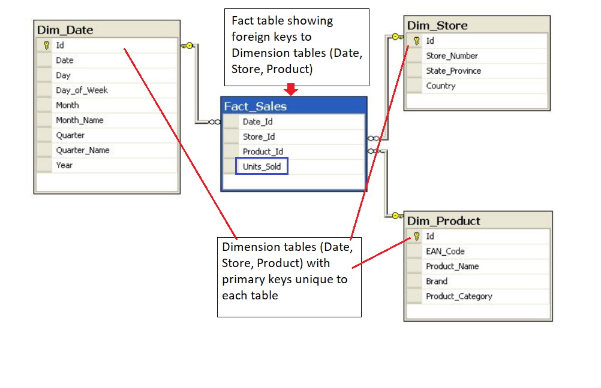

# Relational Data Models
- [x] [OLAP vs OLTP](#olap-vs-oltp)
- [x] [Normalization](#normalization)
- [x] [Denormalization](#denormalization)
- [x] [Fact and Dimension Tables](#fact-and-dimension-tables)
- [x] [Star and Snowflake schemas](#star-and-snowflake-schemas)
- [x] [Upsert](#upsert)
- [x] [Terminology](#terminology)

## OLAP vs OLTP
We can divide IT systems into analytical (OLAP) and transactional (OLTP). In general we can assume that OLTP systems provide source data to data warehouses, whereas OLAP systems help to analyze it.

- **OLAP (On-Line Analytical Processing)** is characterized by relatively low volume of transactions. Queries are often very complex and involve aggregations. For OLAP systems a response time is an effectiveness measure. OLAP applications are widely used by Data Mining techniques.

In OLAP database there is aggregated, historical data, stored in multi-dimensional schemas (usually star schema). For example, a bank storing years of historical records of check deposits could use an OLAP database to provide reporting to business users.

> OLAP databases optimized for these workloads allow for **complex analytical and ad hoc queries**, including aggregations. These type of databases are optimized for reads.

- **OLTP (On-Line Transaction Processing)** is characterized by a large number of short on-line transactions (INSERT, UPDATE, DELETE). The main emphasis for OLTP systems is:
    - put on very fast query processing,
    - maintaining data integrity in multi-access environments
    - and an effectiveness measured by number of transactions per second.

In OLTP database there is detailed and current data, and schema used to store transactional databases is the entity model (usually 3NF).

> OLTP databases optimized for these workloads allow for **less complex queries in large volume**. The types of queries for these databases are read, insert, update, and delete.

The key to remember the difference between OLTP and OLAP is transactions (T) vs analytics (A).
- If you want to get the price of a shoe then you are using OLTP (this has very little or no aggregations).
- If you want to know the total stock of shoes a particular store sold, then this requires using OLAP (since this will require aggregations).

## Normalization
Normalization is the process of **structuring** a relational database in accordance with a serie of **normal form** in order **to reduce data redundancy and increase data integrity**.

> Normalization is to reduce data redundancy and increase data integrity.

### Objectives of Normal Form
1. To free the database from unwanted insertions, updates, and deletion dependencies.
2. To reduce the need for refactoring the database as new types of data are introduced.
3. To make the relational model more informative to users.
4. To make the database neutral to the query statistics.

### Normal Forms
The process of normalization is a step by step process:
- First Normal Form (1NF)
- Second Normal Form (2NF)
- Third Normal Form (3NF)

This is a progressive process and each form must be met before the next form can be completed. There are more normal forms, actually up to six normal form. 4NF to 6NF is really just more for academic and research purposes, and it is really not done in production.

#### How to reach 1NF ?
- Atomic values: each cell contains unique and **single** values. It means, no sets, collections, or lists of values in a column.
- Be able to add data without altering tables. It means, no adding or removing columns.
- Separate different relations into different tables.
- Keep relationships between tables together with foreign keys.

#### How to reach 2NF?
- Have reached 1NF.
- **All** columns in the table must rely on the Primary Key. This means that there should be **no composite keys** to get field.

#### How to reach 3NF?
- Must be in 2NF.
- No transitive dependencies. It means that to get from A to C, we want to advoid going through B.

## Denormalization
Denormalization is the process of trying to improve the read performance of a database at the expense of losing some write performance by adding redundant copies of data.

> Denormalization must be done in read heavy workloads to increase performance.

The process of denormalization is all about performance.

JOINs on the database allow for outstanding flexibility but are extremely slow.

> Denormalization comes after normalization.

### Logical Design Change
1. The Designer is in charge of keeping data consistent.
2. Reads will be faster (select).
3. Writes will be slower (insert, update, delete).

Data consistent means that since we have more copies of data, we'll need to make sure that each one of those copies is updated or deleted at the same time.

> Duplicate data is ok in a denormalized form.

### Denormalization vs. Normalization
- **Normalization** is about trying to increase data integrity by reducing the number of copies of the data. Data that needs to be added or updated will be done in as few places as possible.
- **Denormalization** is trying to increase performance by reducing the number of joins between tables (as joins can be slow). Data integrity will take a bit of potential hit, as there will be more copies of the data (to reduce JOINs).

## Fact and Dimension Tables
Fact and dimension tables work together to solve business problems.
- **Fact table** consists of the measurements, metrics or facts of a business process. Fact tables normally have ints or numbers. 

> Fact tables can be aggregations of data, but are not meant to be updated in place like a dimension table would.

- **Dimension tables** are all the other pieces of information that are not included in the fact tables. Normally, these are textual information or numbers that are not used for analysis like year or date. 

> Each dimension table has one or more fact tables joined together with a foreign key.



## Star and Snowflake schemas

### Star schema
**Star schema** consists of one or more fact tables referencing any number of dimension tables. The star schema is the simplest style of data mart schema.

#### Benefits of star schema
- Denormalize tables
- Simplify queries
- Fast aggregation

#### Drawbacks of star schema
- Issues come with denormalization: issues around data integrity and decrease query flexibility will come up.
- Many to many relationship.

### Snowflake schema
**Snowflake schema** is a logical arrangement of tables in a multidimensional database represented by centralized fact tables which are connected to multiple dimensions.

A complex snowflake shape emerges when the dimensions of a snowflake schema are elaborated, having multiple levels of relationships, child tables having multiple parents.

#### Snowflake vs Star schema
- Star schema is a special, simplified case of the snowflake schema.
- Star schema does not allow for one to many relationships while the snowflake schema does.
- Snowflake schema is more normalized than Star schema, but normally only in 1NF or 2NF.

## Upsert
The term **upsert** refers to the idea of inserting a new row in an existing table, or updating the row if it already exists in the table. The action of updating or inserting has been described as **upsert**.

The way this is handled in PostgreSQL is by using the `INSERT` statement in combination with the `ON CONFLICT` clause.

```SQL
INSERT INTO customer_address(id, street)
VALUES (432, '923 Knox Street, Suite 1')
ON CONFLICT (id)
DO NOTHING;
```

```SQL
INSERT INTO customer_address(id, street)
VALUES (432, '923 Knox Street, Suite 1')
ON CONFLICT (id)
DO UPDATE
	SET street = EXCLUDED.street;
```

## Terminology
1. **OLAP** (On-Line Analytical Processing): OLAP databases are optimized for reads and for complex analytical and ad hoc queries, including aggregations. An effectiveness measure is the response time.
2. **OLTP** (On-Line Transaction Processing): OLTP databases are optimized for less complex queries in large volume. An effectiveness measure is the number of transactions per second.
3. **Normalization**: is to reduce data redundancy and increase data integrity.
4. **Denormalization**: is to improve the read performance. Denormalization comes after normalization. Duplicate data is ok in a denormalized form.
5. **DDL** (Data Definition Language) allows to perform various operations on the database such as create, alter, and delete.
6. **Star schema** consists of one or more fact tables referencing any number of dimension tables.
7. **Snowflake schema** is represented by centralized fact tables which are connected to multiple dimension tables.
8. **Upsert** refers to the idea of inserting a new row in an existing table, or updating the row if it already exists in the table.

## Reference
1. [What are OLTP and OLAP. What is the difference between them?](https://stackoverflow.com/questions/21900185/what-are-oltp-and-olap-what-is-the-difference-between-them)
2. [OLTP vs. OLAP](https://www.datawarehouse4u.info/OLTP-vs-OLAP.html)